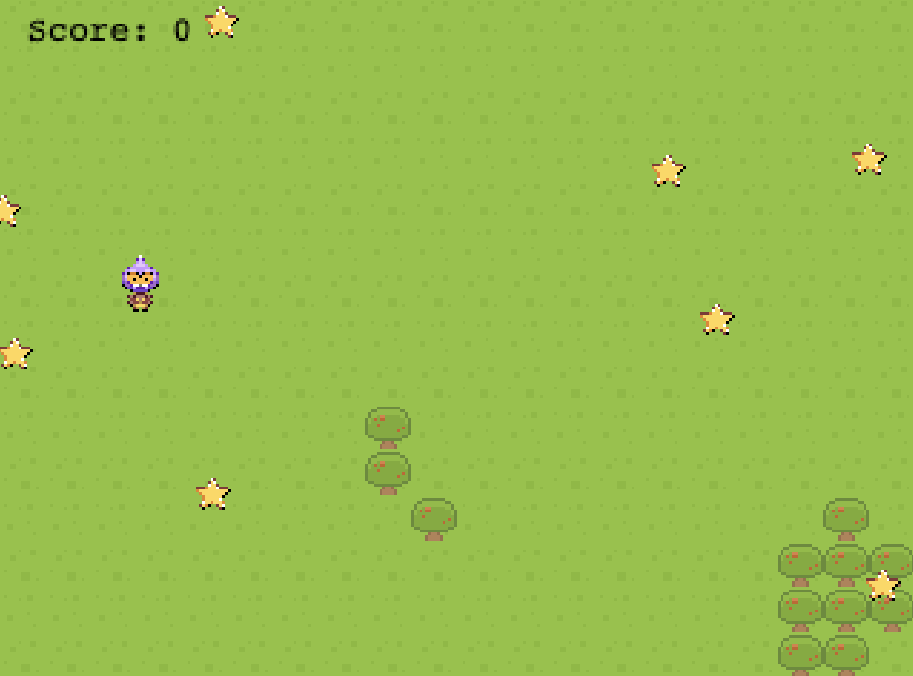

**🎮️ Name of the game: Bomb Evader\
👥 Stakeholders:**

- Dev: [@](https://help.nuclino.com/988f802d-mention-a-team-member)[Azeez Ibrahim](https://github.com/kunmi02/)
- Design: [@](https://help.nuclino.com/988f802d-mention-a-team-member)[Azeez Ibrahim](https://github.com/kunmi02/)
- QA: [@](https://help.nuclino.com/988f802d-mention-a-team-member)[Azeez Ibrahim](https://github.com/kunmi02/)

# Overview

## 📐 Project scope

- **Budget: None**
- **Timeline: Within 5 working days**

## 🗣️ Elevator Pitch

_It's a 2d game with a lost soldier who found himself in a field filled with land mines. His mission is to collect all the stars on the field without stepping on the mines. The bombs are hidden on the field and there is no tip or notification to tell the soldier where a mine is. The soldier needs to use his instinct to walk around the field to get the stars_

## 💵 Monetization

_This was created for educational purposes only._

# Story

_A lost soldier finds himself in a field to collect stars and avoid bombs._

Sounds familiar?

# Gameplay

The soldier can move around the field to where stars are located.

## Core Game Mechanic

- Details: Build platform game with Phaser3 Library
- How it works: Using Phaser3 JS library to create the canvas and different scenes.
- Details: Add platform and player sprite & Animate it.
- How it works: Collected assets from different resources and used Phaser3 to animate and edit different features like size, respawn, velocity, movement, color.
- Details: Add game objects
- How it works: Added glowing stars and hidden bombs and modified score upon collecting stars and death scene upon stepping on a bomb.
- Details: Add a scoreboard
- How it works: Use API to store player name and score, Then get this data and sort the top highest 5 scores and display them.

# Game elements

# 👤 Characters / 📦️ Objects

- A lost soldier
- Bombs
- Stars
- Trees
- Grasses

## 🏆️ missions

- [Gotta Catch ‘Em All!](https://www.youtube.com/watch?v=MpaHR-V_R-o) 1 star = 100 score
- Avoid traps
- Avoid falling

# Assets

## 🎨 Art

- [Art Assets: Dusk Mountain Background | Ansimuz Games](https://ansimuz.com/site/art-assets-dusk-mountain-background/)
- [Kenney • Assets](https://www.kenney.nl/assets)

## 🔊 Sound

- [Mario Jump - Gaming Sound Effect (HD)](https://www.youtube.com/watch?v=37-paiEz0mQ)
- [Underwater Theme - New Super Mario Bros.](https://www.youtube.com/watch?v=vu9p5M9CHOg)

## 🏃‍ Animation

- Walk
